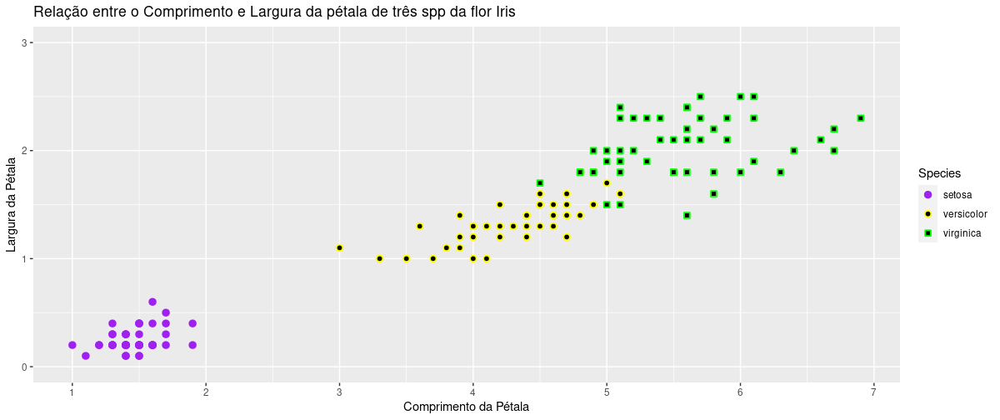
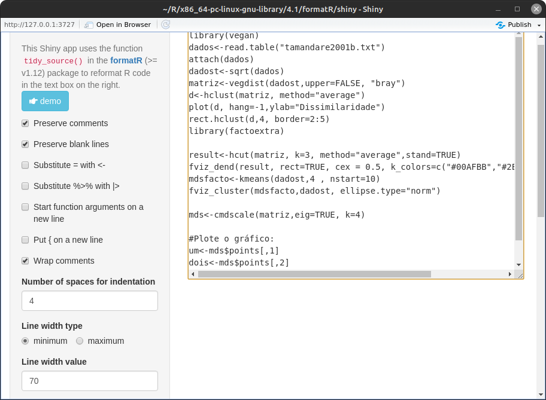
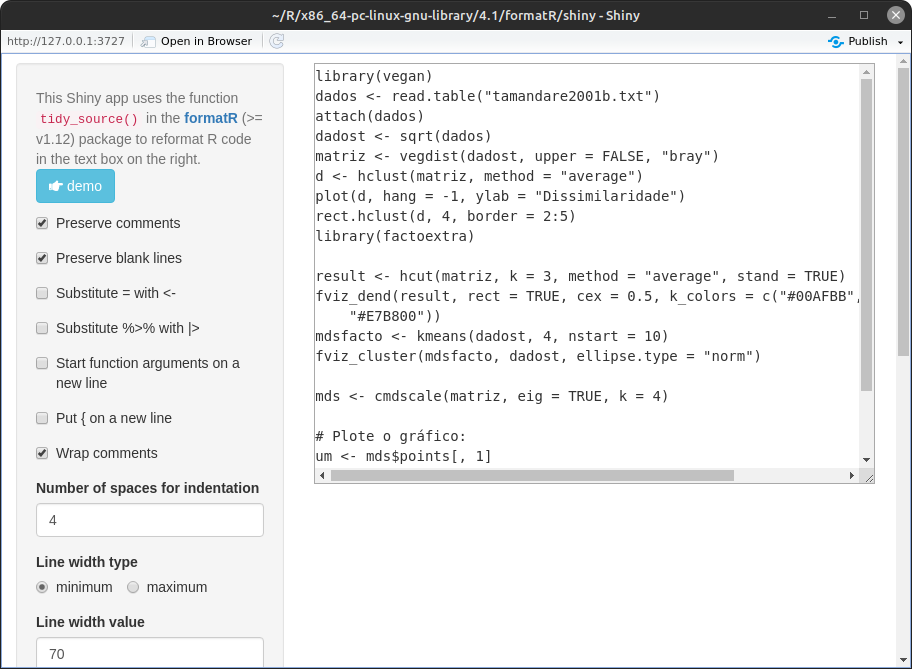
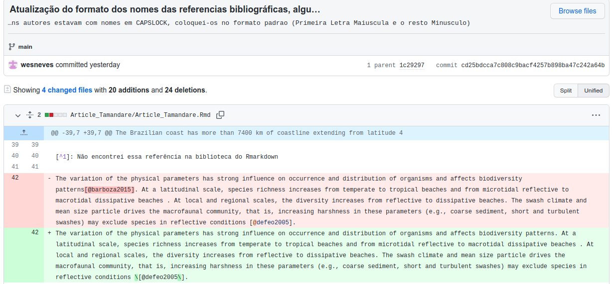
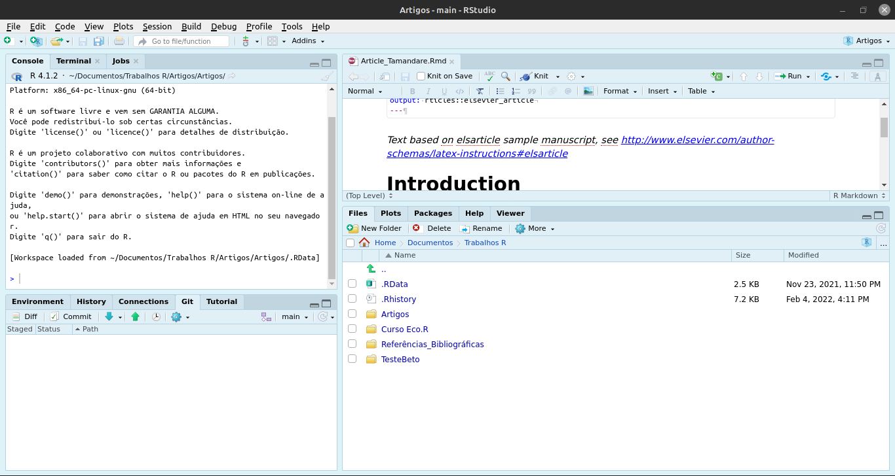
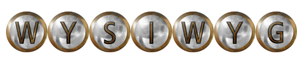

```{js, echo=FALSE}
$('.title').css('color', 'green')
```

# Módulo 1 -- Conhecendo o Ambiente R

# Linguagem de Programação

Linguagem é uma estrutura sistemática que tem por objetivo a transmissão de ideias e sentimentos (comunicação), ela pode ocorrer através da fala (a língua é um tipo de linguagem que podemos classificar como verbal), escrita (sinais ou símbolos) ou outros signos convencionais. Dessa maneira, uma linguagem de programação é um conjunto de símbolos, sintáticas, regras semânticas destinadas ao controle de uma máquina, por isso ela é uma forma de comunicação entre o ser humano e o computador.

A comunicação entre Homem e Máquina é mediado pelo uso da linguagem de programação, esta por sua vez pode ser classificada como linguagem de alto nível e linguagem de baixo nível, esta classificação está baseada no nível de abstração de cada linguagem de programação.

## Linguagem de Alto Nível

São linguagens cuja sintaxe são voltadas para o entendimento humano, logo, tais linguagens são mais intuitivas/amigáveis. Para que exista um canal de comunicação entre o emissor (homem) e o receptor (máquina) é necessário que o código seja abstraído e sintetizado de modo que ambos entendam, já que o computador só compreende a linguagem binária. Tomamos como exemplo o Código "PRINT", o emissor que no caso somos nós, estabelecemos esse comando que será abstraído/ convertido em zeros e uns através dos compiladores para a máquina e ela por sua vez retornará funções que mostrem o conteúdo capturado na tela do computador. São exemplos desse tipo de linguagem o JavaScript, Python, C#, PHP etc.

É intuitivo pensar que os códigos escritos precisam ser compilados ou interpretados para que a máquina entenda o que queremos transmitir. Quando um código é compilado, é gerado outro arquivo que contém todo o código traduzido para algo mais próximo da linguagem da máquina (no caso é um programa em Assembly). Já quando o código é interpretado, cada linha de comando é "traduzida" no momento da execução e é aqui que o Programa R se encaixa. É justamente isso que eleva o tempo de processamento.\

## Linguagem de Baixo Nível

São linguagens voltadas para o entendimento da máquina, logo, tais linguagens possuem uma sintaxe mais complexa e não contam com comandos muito intuitivos. Como mencionado anteriormente, a linguagem da máquina é constituída por sequências de 0 e 1, então a linguagem de baixo nível tem instruções mais diretas para o processador do computador, logo, tais instruções são mais próximas da linguagem da máquina. Um exemplo de tal linguagem é o Assembly.

A linguagem de baixo nível é "traduzida" pelo que chamamos de montador (assembler), que é o responsável por converter o programa Assembly em um conjunto de instruções na linguagem de máquina. Com isso, podemos perceber que o Assembly também atua como uma espécie de interface entre a linguagem de alto nível e a linguagem da máquina.

## Linguagem de Alto Nível vs Baixo Nível

Um simples exemplo é se o emissor deseja que a máquina mostre na tela o código Oi Wesley!.

Em Python (Alto Nível) o Emissor escreveria o seguinte comando: print(" Oi Wesley!")

```{python}
x = 'Oi Wesley!'
print(x.split(' '))
```

Em Assembly tal comando seria transcrito da seguinte forma:

lea si, string\
call printf\
hlt\
string db "Oi Wesley!", 0\
printf PROC\
mov AL, SI\
cmp AL, 0\
je pfend\
mov AH, 0Eh\
int 10h\
inc SI\
jmp printf\
pfend:\
ret\
printf ENDP

## Vantagens e Desvantagens de cada uma

**Alto Nível:** As principais vantagens são o fácil aprendizado e o baixo custo operacional. As desvantagens reside na exigência de um tempo de processamento maior para executar determinados comandos, por isso que o desempenho de um programa pode ser prejudicado, outra desvantagem é que essa linguagem ocupam mais memórias se comparadas as de baixo nível.

**Baixo Nível:** A principal vantagem está no tempo de processamento muito mais rápido do que numa linguagem de alto nível. A desvantagem está na dificuldade de abstração de conceitos nessa linguagem, outra desvantagem é que esses códigos são dedicados a tipos de processadores, logo sua compatibilidade é extremamente limitada.

**Resumindo:** Uma linguagem busca facilitar o entendimento humano, enquanto outra se aproxima mais da linguagem da máquina

# O que é o programa R?

O R é uma linguagem de programação de alto nível, interpretada, de script, tipagem dinâmica forte e multiparadigma (possui uma ênfase em programação funcional). Essa linguagem de programação é voltada para a manipulação, análise e visualização de dados. importante perceber que esse ambiente de programação nada mais é que um projeto GNU semelhante a linguagem e ambiente S desenvolvido pela *Bell Laboratories* por John Chambers e colegas. Por ser basicamente um projeto GNU, o R é um software livre que pode ser estendido através da utilização de pacotes por meio da família CRAN de sites da internet. O termo ambiente pretende caracterizar o R como um sistema totalmente planejado e coerente e ai está a principal diferença entre esse ambiente com os sofwares de análise de dados, o R permite ao pesquisador certa liberdade na hora da análise de dados, já que tal ambiente de programação acompanha o progresso científico, ou seja: novas abordagens metodológicas são desenvolvidas e disponibilizadas nessa plataforma através da criação de pacotes estatísticos, que são disponibilizados para a comunidade científicas através da página oficial CRAN ou pelo github.

O programa foi desenvolvido por George Ross Ihaka e Robert Clifford Gentleman em 1991, nesta ocasião, os professores (Ihaka e Gentleman) que trabalhavam na Universidade de Auckland (Nova Zelândia) desenvolveram uma alternativa à linguagem S, na qual foi oficialmente divulgado em 1995. Em 1997, um grupo central responsável pelas atualizações e estabilizações do programa foi criado e chamado de R Development Core Team, no mesmo ano surgiu o CRAN (Comprehensive R Archive Network) que consiste num conjunto de sites (espelhos) que transportam material idêntico com as contribuições do R de uma forma geral.

A linguagem R é uma linguagem **interpretada**, isto é, o código fonte nessa linguagem é executado por um programa de computador (interpretador) na qual interpreta linha por linha (e aqui está a diferença entre uma linguagem compilada e uma interpretada, na linguagem compilada o compilador converte todo o código de uma vez para a linguagem binária, por causa disso o processo compilado é muito mais rápido que o traduzido, na qual o processo é repetitivo, pois o interpretador processa o código linha por linha) que em seguida é processado pelo sistema operacional ou processador.

# O que é o RSTudio?

Basicamente o RStudio (Figura 1) é uma interface gráfica criado por Joseph J. Allaire. Essa interface deixou o R mais popular, já que o RStudio facilita a utilização de vários recursos por meio de botões e uma interface parecida com os programas usuais utilizados por vários sistemas operacionais.

Digamos que o RStudio é mais amigável com o estudante que está aprendendo essa nova linguagem. Uma das vantagens dessa interface é a disposição de quadrantes que organizam as atividades dentro dessa plataforma. Podemos configurar a aparência e a ordem dos quadrantes no RStudio em: *Tools \> Global Options \> Appearance e em Pane Layout*.

# Instalando o R e o RStudio:

Como mencionamos anteriormente, uma das vantagens do "programa R" é sua compatibilidade com vários sistemas Operacionais, portanto, vamos mostrar como podemos instalar esse sistema tanto no Windows como no Linux Mint (Uma das distros mais utilizadas do Linux e foi baseada no Ubuntu, portanto essas duas distros possuem ampla compatibilidade entre si).

## Instalando o R e RStudio no Windows

Podemos instalar o R nesse [link](https://cran.r-project.org/bin/windows/base/) e o RStudio [nesse](https://rstudio.com/products/rstudio/download/#download) respectivamente

## Instalando o R e o RStudio no Linux Mint

Essa etapa é um pouco mais complicada, no primeiro passo iremos acessar o site oficial do [R](https://cran.r-project.org/) em seguida escolhemos a opção *"Download R for Linux"*, depois selecionamos a opção *"ubuntu/"* e copiamos a chave do repositório para isso clicamos na opção "full README", logo iremos copiar o apt-key, no nosso caso copiaremos a chave **"E298A3A825C0D65DFD57CBB651716619E084DAB9"**, com a chave copiada é só acessar no meno iniciar o aplicativo *"Fontes de Aplicativos"*, em seguida basta clicar na **Chaves de Autenticação** e apertar em baixar, dai é só colar a chave copiada e apertar em OK, após isso aceite a atualização do repositório. Precisamos adicionar o repositório Para isso iremos acessar novamente a página do R e vamos copiar o comando\
"deb <https://cloud.r-project.org/bin/linux/ubuntu> focal-cran40/", em seguida Adicionaremos esse repositório no aplicativo **Fontes de Aplicativos** e em Adicionar apertaremos em OK, logo adicionaremos o seguinte comando: *"sudo apt-get install r-base r-base-dev"* no terminal (Ctrl + Alt + T) e confirmamos a instalação digitando S e apertando Enter.

Para abrir o R no terminal é só digitar o R maiúsculo e apertar Enter. ]

Para instalar o RStudio é só acessar o link do [RStudio](https://rstudio.com/) ir na opção downloads e escolher a versão Ubuntu18/Debian 10, após baixado é só instalar normalmente como faria no Windows apertando o botão Instalar Pacotes.


# Entendendo o Funcionamento do R:

Segundo Chambers em seu livro *"Extending R"* o programa R tem uma estrutura interna uniforme para representar todos os objetos, resumidamente essa estrutura é composta por chamadas de funções que possuem objetos como argumentos e como valor.

Podemos sumarizar esse conceito em três princípios, sendo eles:

-   **Princípio do Objeto:** Na qual afirma que tudo que existe no R é um OBJETO

-   **Princípio da Função:** Tudo que acontece no R é uma chamada de FUNÇÃO

-   **Princípio da Interface:** Interfaces para outros programas são parte do R.

Podemos resumir o funcionamento do programa na seguinte situação: Toda ação que acontece nesse programa é realizado através de uma **chama de função** o resultado dessa chama de função é *armazenada* na forma de um **objeto** que por fim é associado a um nome.


# Iniciando o R/RStudio:

Nas linhas de comando do R, mais especificamente no console do RStudio haverá um sinal de \>, que indica o prompt, na qual representa que o programa está esperando um comando para realizar uma tarefa. É após esse sinal que iremos escrever nossas linhas de comando. Podemos alterar esse símbolo, escrevendo o seguinte comando

```{r}
options(prompt = "W>")
#Toda vez que o console iniciar, começará por 'W>'
```

É importante estar atento quanto aos nomes dos nossos objetos, já que o programa diferencia letras maiúsculas e minúsculas, logo, não podemos chamar a função `library(vegan)` escrevendo `Library(Vegan)`.

## Regras sintáticas do Programa

Ao nomear um Objeto, devemos optar pela utilização de letras ou dígitos (preferencialmente); Não podemos iniciar o nome com underline ( \_ ); Também não podemos utilizar qualquer uma das palavras reservadas pela linguagem como os operadores lógicos TRUE, FALSE, os operadores de controle IF, FOR, ELSE, WHILE. Se estiver em dúvida utilize a função ?`Reserved()`.

Devemos utilizar o ponto para representar os números decimais, já que os símbolos , . \\ / ; representam funções específicas dentro da linguagem. Como bem sabemos que o R é uma linguagem interpretada, devemos apertar o enter em cada linha de comando digitada para que o console execute tais comandos, ou podemos simplesmente adicionar ; em cada sentença para que o R rode automaticamente todo o código escrito e separado por ponto e vírgula ( ; ), caso o comando digitado esteja incompleto, o programa substituirá o símbolo ( \> ) do prompt por um sinal aditivo ( + ). Aqui está uma vantagem do RStudio, se pretendermos escrever o comando para abrir um determinado objeto do tipo função, na qual apresentam argumentos necessários para utilizar de forma correta tais funções, pois esses argumentos apresentam requisitos e elementos necessário para a plena execução dessas funções. Para exemplificar essa vantagem vou utilizar a uma função para abrir pacotes disponíveis na biblioteca do nosso disco rígido, por exemplo, basta escrever `librar` *(de forma incompleta mesmo e o programa vai sugerir imediatamente o complemento dessa função, que no caso é `library()`, além disso o programa informará automaticamente uma descrição bem resumida da função escrita e dos argumentos que compõe tal função, e se apertarmos F1 automaticamente o programa abrirá a página de ajuda da função/pacote no quadrante help)*.

Para encerrar o R/RStudio é só fechar o programa ou escrever `q()`

Esta função geralmente é seguida por uma pergunta *save workspace image? y/n/c*. Se a resposta dada for y (sim), o programa salvará os conjuntos de dados armazenados na memória, bem como o histórico de comandos. É sempre interessante escrever um registro das análises feitas gravando os comandos em um arquivo de texto chamado arquivo de script, no RStudio basta apertar Ctrl + Enter para que a linha de comando escrita no Script rode no Console.

## Comandos de Ajuda no RStudio

Podemos abrir facilmente a página de ajuda de um determinado pacote ou função, por exemplo, em ambos os programas (R/RStudio) podemos escrever o comando `help(lm)` para que a página de help abra em um dos quadrantes da plataforma, do mesmo modo podemos escrever a expressão `?lm`, para acessar essa mesma página de ajuda.

## Diretório de Trabalho

Basicamente um dos principais erros que acontece em uma rotina de programação R é acessar algum arquivo que não está no diretório de trabalho ou até mesmo salvar em um diretório sem ao menos prestar atenção onde o programa está salvando/acessando os arquivos. Esse lugar é conhecido como diretório de trabalho e o R estabelece uma conexão com esse lugar toda vez que o programa é iniciado. Para verificar seu diretório de trabalho, utilize o comando:

```{r}
getwd()
```

Para alterar o diretório de trabalho existe a função `setwd()`\
No RStudio basta acessarmos *Tools/Global Options/General/Default Working Directory (when not in a project)*:

`setwd("/home/weneves/Documentos/Trabalhos R")`

**OBS:** O programa só aceita o formato padrão da Barra Oblíqua / e não a Barra Invertida \\ Se você optar em copiar o endereço de um arquivo que não está no diretório de trabalho, basta ir em Propriedades do arquivo e copiar o endereço. O endereço por padrão está escrito com as barras invertidas, então ou você duplica essas barras invertidas ( \\\\ ) ou inverte para a Barra Normal ( / ). Para salvar o workspace utilizaremos o comando 'save.image() ou Ctrl + Alt + S (RStudio)

O R gravará o workspace no arquivo .RDATA. O .RData salvará todos os objetos criados que estão atualmente disponíveis e o .Rhistory salvará todas as linhas de comandos inseridas no console. Ao iniciar o R no mesmo diretório onde esses arquivos foram salvos, é carregado toda a sua área de trabalho anteriormente, bem como o histórico das linhas de comando utilizadas.

# Comandos Elementares:

Toda ação que pode ser executada no R pode ser dividida em duas (Expressão e Atribuição), se quiséssemos utilizar o R como calculadora, podemos simplesmente executar o comando:

```{r}
1000 + 1014
```

Isto acontece por causa do segundo princípio *Tudo que acontece no R é uma chama de função* o símbolo de adição no R é simplesmente uma função interna primitiva que foi implementada em outra linguagem. É importante lembrar que toda expressão utilizada no programa fica temporalmente armazenada na memória ativa do computador e uma vez que o resultado é impresso no console, o valor é perdido. Podemos contornar esse problema utilizando o segundo tipo de comando elementar que é a Atribuição (na qual podemos utilizar a junção dos símbolos \<- ou =, sendo esse segundo não recomendado, assunto que falaremos posteriormente) não importa a ordem de associação, por exemplo:

```{r}
x <- 25; x
25 -> x; x
```

Também podemos utilizar o comando `assign()`:

```{r}
assign("name", "wesley"); name
```

Quando utilizamos o comando de atribuição no console, o R armazena o nome associado ao objeto (é importante lembrar que ao utilizarmos essa função, estamos apenas associando um nome a um objeto, que no caso pode ser uma função, um valor, um caractere etc e não estamos de fato, utilizando essa função para criar um objeto) na sua área de trabalho que é comumente chamada de Ambiente Global (o propósito de um ambiente no R é associar um conjunto de nomes a um conjunto de valores)

Podemos criar alguns nomes e associá-los a alguns valores, por exemplo:

```{r}
D <- c("25-07-2014"); x <- 3.14; e <- 2.71; D; x; e
```

Podemos verificar todos os nomes armazenadas no ambiente global através da função `ls()`

```{r}
ls()
```

# Objetos

Lembrando do primeiro princípio do R *Tudo que existe no R é um Objeto*, e o que seria esse tal de objeto?

A ciência da computação define um objeto como um local da memória destinado a um determinado valor, dessa forma, o objeto pode ser uma variável, uma função ou simplesmente uma estrutura de dados. Mas na Programação Orientada a Objetos, a palavra se refere a um Molde/Classe que passa a existir a partir de uma instância da classe, ou seja, a classe define o comportamento do objeto (utilizando para tais, seus atributos que nada mais são que propriedades e suas ações que são seus métodos). Dessa maneira, podemos resumir a definição de objeto como uma entidade no ambiente R que possuí características internas e tas características são extremamente necessárias para que o programa possa interpretar sua estrutura e seu conteúdo, como vimos acima, tais características são chamadas de atributos.

Podemos retornar ao enunciado que comumente proferimos ao utilizar o R *"Criei um objeto x que recebe um valor y"*. Segundo a lógica de funcionamento do R, tal afirmação é bastante imprecisa e o correto seria afirmar que o objeto y recebe um nome ou mais corretamente "está se ligando" ao nome x, ou seja, o objeto não tem um nome, mas o nome possui um objeto. Para visualizar qual objeto associado a um nome, basta digitarmos no console o nome associado a tal objeto e apertar a tecla ENTER.

Como afirma Paradis em seu livro "R for Beginners" os objetos são caracterizados pelos seus nomes e pelo seu conteúdo, sendo mais específico seu atributo que normalmente irá especificar o tipo de dados representados por um objeto. podemos utilizar o mesmo exemplo que o autor citado acima trás em seu livro: *"considere uma variável que assume o valor 1, 2 ou 3: tal variável pode ser uma variável inteira (por exemplo, o número de ovos em um ninho), ou a codificação de uma variável categórica (por exemplo, sexo em algumas populações de crustáceos: machos, fêmeas ou hermafroditas). É claro que a análise estatística desta variável não será a mesma em ambos os casos: com R, os atributos do objeto fornecem as informações necessárias".* Logo, a ação de um objeto depende dos seus respectivos atributos.

No R todos os objetos possuem uma classe e dois atributos intrínsecos. A forma de verificar a classe de um objeto é através da função class(), mas essa função pode apresentar resultados equívocos e por isso podemos utilizar a função sloop::s3_class() do pacote sloop.

***OBS:*** também existe um atributo chamado classe (class) e os objetos que possuem tal atriuto são apenas os desenvolvidos na programação orientada a objetos (que é uma programação desenvolvida em um dos principais paradigmas da programação que é baseada no conceito de objetos).

```{r}
q <- 10; a <- factor(q); class(q); class(a)
```

Apesar do objeto a possuir o mesmo "conteúdo" que q, pelo simples fato de atribuímos a classe factor ao objeto a, o valor contido em tal nome deixa de se comportar como numérico e passa a ser considerado como fator, portanto, realizar operações algébricas com o objeto a é impossível.

A função `attibutes()` verifica se determinado objeto possuí o atributo class. As classes dos objetos podem ser: *numeric, logical, character, list, matrix, arraym factor e data.frame.* Podemos remover a classe de um objeto com a função `unclass()`. Vamos observar como um data frame se comporta sem a sua classe:

```{r}
neo <- data.frame(a = 1:16, b = LETTERS[1:16]); class(neo)
```

Agora vamos remover a classe do objeto neo:

```{r}
b <- unclass(neo); b; class(b)
```

Observamos que sem o atributo de classe *data.frame* o objeto tem a classe list, ou seja, mesmo que os dados possuam uma estrutura de lista ele se comporta como data.frame se possuir o atributo data.frame.

## Atributos Intrínsecos

Todos os objetos no R possuem dois atributos intrínsecos sendo eles o **modo** e o **comprimento**.

-   O modo é o tipo mais básico dos elementos do objeto e existem cerca de quatro modos principais sendo eles *numérico, caractere, complexo e lógico* (existem outros modos, mas eles não representam dados, como a função e expressão).

-   O comprimento é o número de elementos do objeto. Podemos facilmente consultar essas informações utilizando as funções`mode()`e `lenght()`, respectivamente:

```{r}
Alunos_R <- 8; mode(Alunos_R)
```

```{r}
Alunos_R1 <- 8L; mode(Alunos_R1)
```

É importante perceber aqui que embora a quantidade de alunos é igual nesses dois exemplos (Alunos_R == Alunos_R1), a função `mode()` é baseada em uma das linguagem que o R foi baseado (linguagem S), logo ela não faz distinção entre números inteiros e numéricos, essa implementação foi disponibilizada na linguagem C (já que boa parte da rotina do R está desenvolvida nessa linguagem, um exemplo é o pacote base), podemos verificar essa informação através do comando `typeof()`

```{r}
typeof(Alunos_R); typeof(Alunos_R1)
```

A diferença entre ambas essas duas formas está simplesmente na forma que o R armazena essas informações na memória do computador, podemos realizar alguns testes no R:

```{r}
is.numeric( Alunos_R)
```

```{r}
is.numeric( Alunos_R1)
```

```{r}
is.integer(Alunos_R)
```

```{r}
is.integer(Alunos_R1)
```

Colocar o 'L' maiúsculo após um número inteiro força o R a armazenar o valor do objeto como um número inteiro, logo, inteiro seria uma subconjunto de numérico.

O termo double retornado pela função`typeof()` significa dupla precisão na linguagem de programação, que acaba tenho uma exigência de mais memória do que o objeto de modo integer. Esses termos são utilizados na linguagem C. Já a linguagem S não os diferencia, utilizando tudo como numeric.

```{r}
Nomes_alunos_R <- c("Beethoven","Chopin","Lizt","Mozart","Bach","Tchaikovsky","Debussy","Schubert"); mode(Nomes_alunos_R)
```

```{r}
Alunos_Matriculados <- Alunos_R == 8; mode(Alunos_Matriculados)
```

```{r}
x <- 3i; mode(x) #Complex
```

O comprimento de um objeto é informado pela função `length()`

```{r}
length(Nomes_alunos_R)
```

# Tipos de Objetos:

Quando nos referimos a tipos de objeto, estamos pensando na forma que os dados estão organizados, um dos tipos mais simples de objetos são os vetores atômicos que armazenam apenas um conjunto de elementos do mesmo modo *(numérico, caractere, complexo e lógico)* pela natureza desses objetos (armazenam elementos de apenas um modo) os dados se comportariam do mesmo modo mesmo constituídos de elementos diferentes, por exemplo:

```{r}
H <- c("shannon", 2.75, 1.68, 2.18, 0.78); H
```

Observamos que todos os elementos dispostos no meu objeto ganharam aspas, se verificarmos o modo desse objeto constataremos que os dados são characteres. Esse fato chamamos de coerção entre vetores. Os vetores lógicos (TRUE e FALSE) serão convertidos em 1 e 0 respectivamente. A função `as. <modo` força a coerção dos objetos e para saber se um objeto possui determinado modo, utilizamos a função `is. <modo`.

Os objetos podem ser resumidos em vetores atômicos ou listas, sendo subdivididos em:

-   Vetores Atômicos *(Lógicos, Numéricos e Caracteres; Matrizes Unidimensionais **Matrix** e Multidimensionais **Arrays**)*

-   Vetores em Listas *(Listas e Quadro de Dados **Data.frames**).* A diferença entre os Vetores Atômicos e os Vetores em Listas é que o segundo suporta a presença de vários modos no mesmo objeto, enquanto os vetores atômicos não.

## Vetor Numérico:

```{r}
dados <- c(1,2,3,4,5,6,7,8,9); dados
```

```{r}
X <- seq(1,10,2); X #Cria uma sequência de números de 1 até 10 2 em 2.
```

```{r}
Y <- rep(2:5, 2); Y #Repete a sequência de 2 até 5 duas vezes.
```

Um conjunto de dados aleatórios pode ser obtido pela função`runif(número de dado, min=,max)`

```{r}
teste <- runif(10, min = 30, max = 65); teste
```

```{r}
#Rnorm()' gera números aleatórios com distribuição normal:
exemplo_distNorm <- rnorm(100, mean = 50, sd = 5); exemplo_distNorm
```

Como selecionar amostras aleatórias de um conjunto de dados?

`sample(x, size, replace)`

x: vetor com o conjunto de amostras, size: número de amostras a serem selecionadas, replace: lógico, TRUE= com reposição, FALSE= sem reposição.

```{r}
sample(1:30, 5, replace = FALSE)
```

## Vetor de Caracter

Vetores com nomes ao invés de números.

**OBS:** No R sequências de caracteres textuais são sempre delimitados por aspas.

```{r}
dados_chopin <- c(Nome = "Frédéric François Chopin", Nascimento = "22/02/1810", Profissao = "Compositor e Pianista"); dados_chopin
```

## Vetor Lógico

Quantidades lógicas no R, sendo eles TRUE, FALSE ou NA

```{r}
is.factor('dados_chopin')
```

## Fator

Fator é um vetor usado para criar variável categórica (medida em uma escala nominal) que são bastantes comuns em análises estatísticas.

```{r}
alturas <- factor(c("baixo","médio" ,"alto")); alturas #notem que utilizamos um acento em médio, isto é possível porque esta palavra aqui é tratada como um caracter (por isso as aspas)
```

```{r}
is.factor(alturas) # testa a conversão
```

## Matriz

Nada mais é que um conjunto de 2 dimensões de vetores (Linhas e colunas)

Escreva matr no RStudio para verificar o corpo da Matrix.

*Corpo da Matrix: (data, nrow(n°linhas), ncol(n°colunas), byrow(F or T Organiza a distr. dos n°), dimnames(nomes))*

```{r}
xyz <- matrix(1:100, ncol = 10, byrow = FALSE); xyz # Matriz com byrow = T -> Distribui os números por linhas # Matriz com byrow = F -> Distribui por colunas
```

```{r}
colnames(xyz) <- c("grupo1","grupo2","grupo3","grupo4","grupo5","grupo6","grupo7","grupo8","grupo9","grupo10"); rownames(xyz) <- rownames(xyz, do.NULL = FALSE, prefix = "Obs."); linhas <- letters[1:10]; rownames(xyz) <- linhas; xyz
```

```{r}
t(xyz)#transpõe a matriz
```

```{r}
class(xyz)
```

```{r}
xyz[,1] #para acessar a primeira coluna de uma matriz. [linha, coluna]
```

`fix(xyz) #edita uma matriz ou data frame IMPORTANTE!!`

```{r}
str(xyz)#avalia a estrutura do objeto
```

```{r}
summary(xyz)
```

## Lista

Uma lista é um objeto que consiste de um conjunto de dados com modos diferentes ordenados de forma hierárquica. Por exemplo, é possível construir uma lista com uma matriz, um vetor lógico etc.

```{r}
loboG <- list(Nome = "Lobo Guará", Reino = "Animalia", Filo = "Chordata", Classe = "Mammalia", Ordem = "Carnivora", Família = "Canidae", Gênero = "Chrysocyon", Espécie = "C. brachyurus", NomeB = "Chrysocyon brachyurus"); loboG
```

## Data Frame

Parecido com uma matriz, a única diferença é que este tipo de objeto aceita vetores de tipos diferentes, por causa dessa característica o data frame é o tipo de objeto mais utilizado no R

```{r}
comunidade <- data.frame(especies = c("D.nanus", "S.alter","I.guentheri", "A. callipygius"), habitat = factor(c("Folhiço", "Arbóreo", "Riacho", "Poça")), altura = c(1.1, 0.8, 0.9, 1), distancia = c(1, 1.7, 0.6, 0.2)); comunidade
```

```{r}
knitr::kable(comunidade)
```

```{r}
DT::datatable(comunidade)
```

```{r}
class(comunidade)
```

```{r}
str(comunidade)
```

`fix(comunidade`

`edit(comunidade)`

O símbolo \$ é o responsável pela seleção das colunas de um data frame, antes do \$ vem o nome do objeto, depois, o nome da coluna.

## Operações no R

|                          |                                                                                                            |
|:------------------------:|:----------------------------------------------------------------------------------------------------------:|
|            \+            |                                 Soma unária, ou binária entre dois vetores                                 |
|            \-            |                                    Subtração pode ser unária ou binária                                    |
|            \*            |                                      Multiplicação entre dois vetores                                      |
|            /             |                                         Divisão entre dois vetores                                         |
|        \^ ou \*\*        |                               Exponenciação binária, isto é 2\^5 ou 2 \*\* 5                               |
|          \% / %          |                                              Divisão inteira                                               |
|            %%            |                                            Restante da divisão                                             |
|          sum()           |                                             Soma de elementos                                              |
|          prod()          |                                           Produto dos elementos                                            |
|          sqrt()          |                                               Raiz quadrada                                                |
|          log()           |                                         Função Logaritmo Neperiano                                         |
|         log10()          |                                        Função Logaritmo na base 10                                         |
|     log(x, base = y)     |                                 Logaritmo na base y do vetor ou escalar x                                  |
|          exp()           |                                             Função exponencial                                             |
|          mean()          |                                                   Média                                                    |
|           sd()           |                                               Descio padrão                                                |
|          var()           |                                                 Variância                                                  |
|         median()         |                                                  Mediana                                                   |
|         round()          |              Arredondamento de vetor numérico. Outros tipos são: trunc(), floor() e ceiling()              |
|  signif(x, digits = n)   |              Arredondamento de vetor numérico. Outros tipos são: trunc(), floor() e ceiling()              |
|        ceiling()         |                               Arredonda o valor do vetor para o maior valor                                |
|         floor()          |                                    Arredonda o valor para o menor valor                                    |
|       factorial()        |                                                  Fatorial                                                  |
|         trunc()          |                                    Trunca (corta) as decimais do vetor                                     |
|         length()         |                                         Retorna o tamanho do vetor                                         |
|          sort()          |                             Retorna o vetor com os valores em ordem crescente                              |
|          max()           |                                      Retorna o valor máximo do vetor                                       |
|          min()           |                                      Retorna o valor mínimo do vetor                                       |
|         range()          |                                        Retorna a amplitude do vetor                                        |
|        summary()         |                                        Sumário estatístico do vetor                                        |
|  aov(y \~ x, data = d)   | Análise de variância unidirecional do quadro de dados d. Variável dependente (y) variável independente (x) |
| aov(y \~ x\*z, data = d) |                                     Análise de variância bidirecional                                      |
|        cor(x, y)         |                                         Coeficiente de correlação                                          |
|     cor.teste(x, y)      |                    Retorna o coeficiente de correlação com um teste-t de significância                     |
|   lm(y \~x, data = d)    |                                        Análise de regressão linear                                         |

## Resumo de Funções

|      Vetor      |         Matriz         |     Array      |
|:---------------:|:----------------------:|:--------------:|
|     names()     | rownames(), colnames() |   dimnames()   |
|    length()     |     nrow(), ncol()     |     dim()      |
|       c()       |    rbind(), cbind()    | abind::abind() |
|       \-        |          t()           |    aperm()     |
| is.null(dim(x)) |      is.matrix()       |    is.array    |

## Operadores Lógicos

| Operadores Lógicos |          Sintaxe          |                    Pergunta                    |
|:------------------:|:-------------------------:|:----------------------------------------------:|
|         \<         |          a \< b           |                a é menor que b                 |
|         \>         |          a \> b           |                a é maior que b                 |
|         ==         |          a == b           |                 a é igual a b                  |
|         !=         |          a != b           |               a é diferente de b               |
|        \>=         |          a \>= b          |             a é maior ou igual a b             |
|        \<=         |          a \<= b          |             a é menor ou igual a b             |
|        %in%        | "a" %in% c("a", "b", "c") | O elemento "a" está no vetor c("a", "b", "c")? |

## Operadores Booleanos

| Operadores Booleanos |        Sintaxe         |                Pergunta                 |
|:--------------------:|:----------------------:|:---------------------------------------:|
|       & ou &&        |     cond1 & cond2      |    As cond1 e cond2 são verdadeiras?    |
|      \| ou \|\|      |     cond1\| cond2      |     A cond1 ou cond2 é verdadeira?      |
|        xor()         |   xor(cond1, cond2)    | Apenas a cond1 ou a cond2 é verdadeira? |
|          !           |         !cond1         |            É falso a cond1?             |
|        any()         | any(cond1, cond2, ...) | Algumas das condições são verdadeiras?  |
|        all()         | all(cond1, cond2, ...) |   Todas as condições são verdadeiras?   |

```{r}
notas.dos.alunos <- c(6.0,5.1,6.8,2.8,6.1,9.0,4.3,10.4,6.0,7.9,8.9,6.8,9.8,4.6,11.3,8.0,6.7,4.5)
```

Quantos valores iguais ou maiores que cinco? `sum(notas.dos.alunos>=5)`

Quantos alunos tiraram abaixo de 5? E abaixo de 4?

Qual a proporção deste valores em relação ao total?

```{r}
sum(notas.dos.alunos >= 5)/length(notas.dos.alunos)
```

Como saber a quantidade dos dados utilizando a função `sum()` com os operadores? *Não vale utilizar a função length.*

```{r}
sum(notas.dos.alunos != 0)
```

# Importando dados no RStudio

O formato **UNIVERSAL** de tabela de dados para análise estatística é o seguinte: cada **LINHA** é uma observação e cada **COLUNA** é uma variável ou atributo que foi tomado em cada observação. Existem diversas maneiras para importar os dados no programa R, Alguns dos formatos mais utilizados são:

-   CSV (Comma separated values), HTML, XML, json, HDF5, Arquivos Xls (EXCEL), Dados em tabela, Dados espaçados por TAB, linhas de arquivos de texto, SPSS, Stata)...

O modelo CSV é o mais utilizado para armazenar informações em tabelas, porque é feito diretamente no EXCEL. Nesse modelo o separador (vírgula, ponto e vírgula) indica a passagem para a próxima coluna e a tabela pode ter um cabeçalho (Header) com os nomes das colunas ou não. O arquivo de texto com extensão .txt, geralmente usa espaços. Isso acaba gerando problema de leitura no R, porque muitos usuários usam nomes de variáveis muito grandes, palavras compostas, de forma a desalinhar as colunas das variáveis. Daí, como a separação das variáveis é por meio de espaços, acaba gerando problema de leitura.

A função primária responsável pela importação de dados é a função `scan()`, as funções`read.table()`,`read.csv()` e `read.delim()`, usam a função`scan()`em seu algoritmo. A primeira ideia sobre importação de dados pode ser inserindo-os pelo teclado no próprio ambiente R. Para isso, usaremos a função scan(). Vejamos:

`o <- scan()`

Após executado essa linha de comando, aparecerá no console 1: que significa, digitar o primeiro valor do objeto x, e depois clicar em ENTER. Depois 2:, que significa digitar o segundo valor, e clicar em ENTER. Depois de inserido todos os valores necessários, aperte a tecla ENTER duas vezes no console, para sair da função scan().

O modo mais simples de importar dados no RStudio é pelo botão *Import Dataset,* na aba *Environment*. Após esse comando podemos configurar a leitura do banco de dados, já que uma prévia de como os dados serão representados estará disponível no quadro Data Frame, se encontrarmos quaisquer problemas devemos resolvê-lo nas opções adicionais como utilizar outro separador, símbolos para casas decimais etc. Por fim é só digitar o nome do objeto e clicar no botão import.

`dados_times <- read.csv("tabela.csv", header = T)`

Por definição essa função abre arquivos que foram salvos utilizando a vírgula como separador, read.csv2 (abre arquivos que foram delimitados por ; )

Para saber qual o separador foi utilizado basta somente abrir o arquivo com o Bloco de Notas.

Utilizamos a função com header = TRUE já que neste CSV, a primeira linha indica o nome das colunas, ou seja, é seu cabeçalho (seu header). Caso utilizássemos header = FALSE, os valores constantes na primeira linha não seriam os nomes das colunas.

O argumento dec="." quer dizer foi usado "." na parte decimal dos dados originalmente digitados, sep = "\\t" quer dizer que quando o arquivo foi salvo com a extensão .txt, optou-se pelo separador de colunascom tabulação.

Também podemos copiar e colar valores diretamente de arquivos, como .pdf ou .docx, através do comando read.delim.

Ctrl+V:

`tabela <- read.delim("clipboard", row.names=1)`

# Manipulação Gráfica

O programa R possui uma interface gráfica que funciona através de comandos e argumentos: Tipos de gráficos: `barplot(); pie(); hist(); plot()`.

Rótulos: main = "nome", xlab = "nome", ylab = "nome"

Tamanho dos caracteres: 'cex' (character expansion)

Titulo: use 'cex.main=valor.

Para os eixos, use o argumento 'cex.axis=valor'.

Para o nome dos eixos, use 'cex.lab=valor'.

Cores: col='blue'

Símbolo do plot (círculo, quadrado,...) usa-se o 'pch'.

Molduras do gráfico: bty="L"- retira as molduras direita e superior; box()- adiciona moldura.

Limite das escalas dos eixos: 'xlim' e 'ylim'.

Linhas, pontos: arrows() - adiciona seta; lines() - adiciona linha; points()- adiciona pontos.

Legenda: legend()

Para inserir um texto dentro do gráfico, utilize o comando "text"

text(posição eixo X, posição eixo Y, "texto a inserir", outros argumentos)

Para inserir um texto fora da área do gráfico, utilize o comando "mtext"

mtext("texto", side = posição, line = posição, adj = posição entre esquerda(0) e direita (1)

**Para salvar gráficos no R em resolução máxima utilizamos o seguinte comando antes de plotar os gráficos:**

`tiff("arquivo.tif", res = 300, type = "windows", width = 3000, height = 2000)`

\
plota o gráfico e encerra com

`dev.off()`

OU

`png(filename="teste.png", height=8, width=16, unit="cm", res=300)`

#Argumento mfrow (colunas,linhas), argumento mar faz referência aos tamanhos dos espaços no gráfico; `par(mfrow=c(1,2)`,`mar=c(1,1,1,1)`, `oma=c(1,1,0,0))`

## GGPLOT2

É um pacote gráfico que faz parte da coleção de pacotes chamada tidyverse destinada para Análise de Dados. A Principal característica desse pacote é que ele descreve um gráfico a partir dos seus componentes, como se fossem camadas. [Ggplot Card](https://github.com/rstudio/cheatsheets/blob/main/data-visualization-2.1.pdf)\

`data("iris"); head(iris); str(iris); class(iris); colnames(iris); install.packages("ggplot2"); library(ggplot2)`

`ggplot(iris, aes(Petal.Length, Petal.Width, color = Species, shape = Species)) +`

`geom_point(fill = "black", size = 2, stroke = 1) +`

`scale_color_manual(values = c("purple", "yellow", "green"))  +`

`scale_shape_manual("Species", values = c(19, 21, 22))+`

`scale_x_continuous(name = "Comprimento da Pétala", breaks = 1:7) +`

`scale_y_continuous(name = "Largura da Pétala", breaks = 0:3, limits = c(0, 3)) +`

`labs(title = 'Relação entre o Comprimento e Largura da pétala de três spp da flor Iris')`

\

### Mapeamento Estético

Responsável pela personalização visual do gráfico

Função aes()

Posição (x e y);

Cor (color);

Tamanho (size);

Preenchimento (fill);

Transparência (alpha);

Texto (label).

Forma (shape)

Objeto Geométrico: Tipo de Gráficos

Função geom\_ + Tipo do objeto

Dispersão (scatterplot): geom_point()

Gráfico de bolhas: geom_point()

Gráfico de barras: geom_bar() e geom_col()

Histograma: geom_histogram()

Boxplot: geom_boxplot()

Densidade: geom_density()

Gráfico de linhas: geom_line()


# Funções

Aqui desenvolveremos e conheceremos mais a fundo o princípio da função do R, segundo o primeiro princípio (princípio do objeto) a função também é um objeto e elas são constituídas por três componentes: Argumentos (função *`formals()`*), Corpo (função *`body()`*) e o Ambiente (função *`environment()`*).

Podemos consultar os três componentes da função aov.

```{r}
formals(aov); body(aov); environment(aov)
```

O Corpo da função é onde está detalhadamente escrito a instrução necessária para que o programa execute determinada ação, podemos verificar o corpo de qualquer função no RStudio escrevendo apenas seu nome no console.

## Chamadas de Funções:

Podemos executar qualquer chamada de função de três maneiras, sendo elas: aninhada, intermediária e pelo operador pipe.

Primeiro iremos criar um conjunto com 50 números aleatórios provenientes de uma distribuição normal (para padronizarmos os dados, vamos enraizar o resultado executando a função `set.seed(5))` em seguida iremos calcular o desvio padrão para esses dados de três maneiras.\

```{r}
set.seed(5); dados_normais <- rnorm(50)
```

-   Função Aninhada:

```{r}
sqrt(var(dados_normais))
```

-   Função Intermediária:

```{r}
variancia <- var(dados_normais)
desvio_padrao <- sqrt(variancia); desvio_padrao
```

-   Operador Pipe: Podemos utilizar esse operador através do pacote *`magrittr (%>%)`* ou pela função nativa `( |> )` do R que foi implementada após a versão \>= 4.1 do R.

```{r}
dados_normais |>
  var()|>
  sqrt()
```

A função **aninhada** possui sua ordem de execução da *direita para a esquerda* e a principal vantagem dessa forma sintática é que não precisamos associar nomes aos objetos na hora da execução da função como fazemos na forma tradicional que é a **intermediária**. Por fim, a sintática do operador **pipe** é a mais complexa para assimilar, *o operador especial tem como primeiro operando o primeiro argumento da função no segundo operando*.

# Estruturas de Controle

As estruturas de controle são extremamente necessárias na hora da execução de uma ação através de qualquer linguagem de programação. Elas se referem a ordem com que as instruções fornecidas são executadas ou avaliadas em programas de computador. A ideia geral de funcionamento dessas funções é

\
`função (condição {            expressão}`\

-   `if()`: Se quisermos executar um determinado código apenas se a condição for verdadeira e se a condição for falsa, queremos que nada seja feito, então:

if (condição) {\
comandos a serem executados caso a condição nos parênteses seja verdadeira\
}\

```{r}
i <- 5
if (i > 3){
  print("Maior que 3!")
}
```

Caso desejamos uma resposta alternativa quando a condição for falsa utilizamos o `else()`

`if (condição) {    expressão sob condição = TRUE} else {    expressão sob condição = FALSE}`

```{r}
if (is.numeric(i)) {
  print("Isso é um número")
} else {
  print("Isso não é um número")
}
```

```{r}
if (is.character(i)) {
  "palavra"
} else {
  if ((i %% 2) == 0) {
    "número par"
  } else {
    if ((i %% 2) == 1) {
      "número ímpar"
    }
  }
}
```

-   `Ifelse()`Sintaxe: ifelse (Condição , comando executado caso a condição seja verdadeira , comando executado caso a condição seja falsa)

```{r}
r <- 4
g <- 6
ifelse(r > g, print(paste("O maior número é:", r)), print(paste("O maior número é:", g)))
```

-   As três estruturas de repetição no R são: repeat, while e for e são utilizadas para loop no programa.

-   `for()`

Função que repete o código seguinte para o comprimento da sequência indicada entre parênteses.

Sintaxe: for (variável in sequência) {\
comandos a serem repetidos\
}

```{r}
for (i in 1:10) {
  print(i)
}
```

-   `while()`

A tradução desta função nos ajuda a entendê-la mais: while significa enquanto. Então podemos ler essa função como: Enquanto alguma condição for verdadeira, o código abaixo será repetido.

Sintaxe: while (condição){\
comandos a serem repetidos\
}

```{r}
k <- 1
while (k <= 10) {
  print((k))
  k <- k + 1
}
```

Note que os dois últimos exemplos resultam na mesma coisa: o R vai retornar os números de 1 a 10 em sequência. Porém nós precisamos mudar o valor de a para que a sequência continue no caso do `while()` enquanto no `for()` a sequência progride sem precisarmos fazer isso manualmente. Além disso, ao usar `while()` precisamos declarar a variável antes para que o R possa testar a condição expressa dentro dos parênteses.

-   repeat()

Usando este comando, o R repetirá o código a seguir sem condições. Com isso, precisamos de mais uma função para mostrar ao programa quando deve parar de repetir o código. A função que faz isso é `break()`. Como sempre existe uma condição a ser satisfeita para o código continuar a ser repetido ou parar, então devemos também usar a função `if()`.

Sintaxe:

repeat {\
Comandos a serem repetidos\
if (Condição para que a repetição pare) break()\
}

```{r}
js <- 1
repeat {
  print(js)
  js <- js + 1
  if (js > 10) break()
  }
```

Neste exemplo obtivemos o mesmo resultado dos anteriores. Note que com o repeat, além de termos que ir aumentando o valor da variável manualmente, também precisamos especificar qual a condição para que o loop pare de ser realizado. Assim como quando usamos `while()`, aqui também precisamos declarar a variável antes.

# Criando Funções

Todas as funções utilizadas até agora no RStudio foram funções já desenvolvidas para o R provenientes de pacotes, algumas delas já são implementadas no programa como o pacote base e outras devem ser baixadas e anexadas ao programa para sua utilização, como é o caso de vários pacotes estatísticos disponíveis no CRAN.

Podemos desenvolver nossas próprias funções através do uso do *`function()`* na qual é um objeto que possui o modo *closure,* que possui sua sintaxe da seguinte forma:

funçãoX \<- function(args1, args2, ...) {\
corpo: comandos..\
}

```{r}
funçãoX <- function(x) {
  rest <- x + 1
  return(rest)
}
funçãoX(x = 24)
```

Observamos que criamos uma função chamada *funçãoX*, cujo argumento de entrada é x. Observe que uma função é como um objeto do tipo vetor, associamos um nome ao objeto da mesma forma. O corpo apresenta uma delimitação por chaves {...}, em que apresenta um comando de atribuição res que se associa a soma x + 1, e por fim, o resultado dessa função, imprime res, por meio da função `return()`.

```{r}
formals(funçãoX)
```

```{r}
body(funçãoX)
```

```{r}
environment(funçãoX)
```

## Escopo Léxico

Observamos que o terceiro componente de uma função do tipo closure é o seu Ambiente, no exemplo acima este ambiente é chamado de ambiente envolvente (ambiente global) esse ambiente representa o lugar onde a função desenvolvida se associou ao seu nome que no nosso caso é *funçãoX*, mas quando a [função é executada]{.underline}, momentaneamente é criado um Ambiente de Execução na qual os nomes que estão no corpo da função serão associados aos objetos.

```{r}
bw <- 25
fun <- function() {
  bw <- 2
  bw
}
fun()
```

Por causa do ambiente de execução que o objeto x dentro da função é retornado, ao invés do que foi definido fora da função. Isso porque o ambiente de execução mascara os nomes definidos dentro da função dos nomes definidos fora da função. Esse é uma primeira característica do escopo léxico nas funções em R.

Anteriormente, falamos sobre a atribuição ( \<- ), que representa a forma como os nomes se associam aos objetos. Agora, o escopo vem a ser a forma como os nomes encontram seus valores associados. O termo léxico significa que as funções podem encontrar nomes e seus respectivos valores associados, definidos no ambiente onde a função foi definida, isto é, no ambiente de função. Claro que isso segue regras, e a primeira foi a máscara de nome falada anteriormente.

Porém quando não existe um nome vinculado a um objeto, e este foi definido no ambiente de função, o valor é repassado para o corpo da função.

```{r}
bw <- 25
fun <- function() {
  bw
}
fun()
```

Diferente do resultado acima, agora, o resultado da execução do comando foi 25, porque como a função procurou no ambiente de execuções e não encontrou esse nome, a função foi até o ambiente superior, no caso, o [ambiente global]{.underline}. Todo ambiente tem um pai (ou ambiente superior). Essa hierarquização é observada no caminho de busca, que pode ser acessado por `search()`, ou seja,

```{r}
search()
```

O ambiente corrente do R sempre será o ambiente ambiente global (.GlobalEnv). O ambiente de execução não aparece, porque ele é momentâneo.

# Dicas para melhorar a sintaxe no R.

Para facilitar nossa compreensão sobre as linhas de comando desenvolvidas no R é aconselhável realizar essas configurações no RStudio que se referem ao diagnóstico do código escrito:

*Tools \> Global options \> Code \> Editing. Marque todas as opções em General;*

*Tools \> Global options \> Code \> Display, Marque todas as opções;*

*Tools \> Global options \> Code \> Diagnostics. Marque todas as opções em R Diagnostics.*

Com essas configurações as linhas de comando estarão estruturadas com cores que distinguem diversas estruturas como funções, espaçamentos etc.

## Melhorando o Script

Existem alguns pacotes que automatizam a forma que organizamos nossas linhas de comando, o pacote *`styler (função styler:::style_active_file())`* e o *`formatR`* formatam nossas linhas de comando contidas em um diretório ou scrip para facilitar a compreensão sintática dos comandos. para mais exemplos acesse a [página](https://yihui.org/formatr)

Um dos erros mais comuns na sintaxe de um código é o seu espaçamento, no geral devemos colocar espaçamento entre a maioria dos operadores básicos do R, exceto pelos operadores :, :: e :::, e sempre é recomendado utilizar um espaço após a vírgula.

## Utilizando o Pacote formatR com o pacote shiny

Se ambos os pacotes estiverem disponíveis no seu RStudio, a função `tidy_app()` pode iniciar um aplicativo Shiny para reformatar o código R por exemplo:

`formatR::tidy_app()`



Na figura acima colamos um scrit para rodar um cluster com uns dados chamados tamandore2001b.txt, perceba que a sintaxe não está muito legível, a função de atribuição está sem espacamento, assim como as demais outras funções no código acima.

Para formatar esse script basta apertar no botão **Format My Code** nesse mesmo visualizador e o resultado será:



Com isso essa função formatará o script da melhor maneira possível.

Também podemos exemplificar como seria a sintaxe ideal para determinado comando, utilizando o pacote style, mas antes de executar essa função no RStudio precisaremos instalar 3 pacotes que são: *`styler`, `prettycode` e `rstudioapi`,* para tanto, vamos utilizar a função *combine `c()`:*

`install.packages(c("prettycode", "styler", "rstudioapi"))`

Em seguida iremos inserir um código

```{r}
fun1 <- "desviopadrao<-sqrt(var(dados_normais))"
```

E executaremos a função *`style_text(fun1)`*

```{r}
styler::style_text(fun1)
```

```{r}
comando <- "media<-mean(x+1/length(x),na.rm=TRUE)"
```

```{r}
styler::style_text(comando)
```

## Utilizando chaves

Quando usamos chaves em um comando, devemos evitar abri-lo e fechá-lo na mesma linha. E ainda, quando é função, as linhas de comando inseridas dentro das chaves, inserimos um recuo de dois espaços para entendermos a hierarquização das funções, isto é, função dentro de função.

No demais, devemos estar atentos em não nomear nossos objetos com os nomes existentes no programa, para verificar se determinado nome já está associado a algum objeto basta utilizar a função *`exists()`,* por exemplo: *exists("aov")* se a função retornar com o TRUE, significa que tal nome já está associado a determinado objeto no programa, devemos utilizar nomes curtos e comentar cada linha de comando com o uso do \# para facilitar o entendimento posteriormente a criação da rotina.

# O que é um Pacote?

Basicamente um pacote é um diretório de arquivos necessários para rodar determinado conjunto de códigos, funções, dados, documentação de ajuda etc. O programa R em sua forma mais básica possui 30 pacotes que são fundamentais para a utilização plena do programa. Existem mais ou menos 17.300 pacotes disponíveis no CRAN. O objetivo básico de um pacote é automatizar rotinas no R, digamos que para um pesquisador calcular o desvio padrão, intervalo de confiança e realizar uma anova nos seus dados ele precise escrever um série de rotinas no programa R, se esse mesmo pesquisador decidir aplicar a mesma metodologia para outro conjunto de dados ele teria que refazer todas as linhas de comando novamente ocasionando trabalhos desnecessários, por outro lado, com a criação de pacotes estatísticos o pesquisador já tem em mãos rotina já prontas esperando apenas algumas linhas de comando para rodar toda a análise.

A estrutura básica de um pacote é composta pelos seguintes "arquivos":

-   DESCRIPTION: que é basicamente um arquivo de texto contendo todas as informações descritivas sobre o pacote.

-   NAMESPACE: serve para destinar a importação e exportação de funções no pacote, ele dita quais funções serão exportadas na hora do carregamento do pacote pela função *library()* ou *require().*

-   R/: é um subdiretório contendo todos os scrips com as funções em R, basicamente é o cérebro do pacote

-   Man/: esse subdiretório apresenta os arquivos de ajuda (.Rd).

# Instalando e Carregando Pacotes

A Função que instala pacotes no R é a *`install.packages()`. E u*m dos pacotes mais utilizados no R é o vegan, ele foi criado por vários pesquisadores e tem o propósito de rodar várias análises no âmbito da ecologia, como Índices de Diversidade, Métodos de Ordenação, Análise da Diversidade e outras funções para ecólogos de comunidade.

`Install.packages("vegan")`

Podemos instalar vários pacotes simultaneamente utilizamos a função c() para criar um vetor: *`install.packages(c("vegan","sos"))`*

Para carregar o pacote utilizamos a função *library(Nome do Pacote Desejado)*

Podemos acessar os dados contidos nos pacotes através do argumento `data()`

# Usando os Operadores :: e :::

Para executarmos uma função de um determinado pacote sem a necessidade de carregar o pacote (library(pacote)) utilizamos o operador ::, contudo se conhecemos a estrutura de um pacote e sabemos que o pacote contém função não exportadas pelo namespace basta utilizar o comando ::: para carregar essas funções, mas não recomendamos a utilização de funções internas no desenvolvimento de pacotes uma vez que tais funções podem passar por mudanças se os desenvolvedores atualizarem algum índice etc.

# Introdução ao GitHub no RStudio

O GitHub é um serviço baseado em nuvem que hospeda um sistema de *controle de versão (VCS)* chamado **git**. A funcionalidade central é a possibilidade de compartilhamento de projetos entre colaboradores, a medida que os colaboradores atualizam e constroem o projeto, o GitHub registra cada alteração garantindo uma clareza para os envolvidos no progresso do projeto em desenvolvimento.


## O que é um Sistema de Controle de Versão?

É necessário entender esse sistema para compreender o funcionamento do GitHub, na medida que os desenvolvedores modificam um projeto existente, seja ele um pacote, um site, artigo científico etc, eles alteram o código fonte base para atualizar esse projeto e é aqui que o VCS entra, ele ajuda os desenvolvedores a acompanhar as mudanças realizadas no código base, registrando o autor da modificação e permite a restauração do código removido ou modificado, por exemplo:



Na imagem acima podemos facilmente perceber o que faz o VCS no GitHub, esse exemplo foi retirado de um diretório que eu fiz chamado Article, nesse diretório criamos um arquivo em Rmarkdown utilizando o Pacote `rticles` para escrever um artigo e submetê-lo de acordo com os padrões exigidos por uma revista de ecologia marinha, pois bem, a parte de cor vermelha é a alteração que fiz como teste na introdução do artigo científico, notem que a citação `[@barbosa2015]` não consta nesse trecho da introdução destacada em verde. Além dessas informações, o programa mostra todas as alterações realizadas por mim através da função **commit:**

> Showing **4 changed files** with **20 additions** and **24 deletions**

## O que é o Git?

Trata-se do coração do GitHub, o Git é um sistema de controle de versão desenvolvido por Linus Torvalds (mesmo criador do Linux). Já que o Git é um VCS qualquer desenvolvedor numa equipe pode gerenciar o código fonte e seu histórico de mudanças usando a **ferramenta de linha de comandos Git.**

::: {align="center"}
{width="300"}
:::

# Sincronizando Repositórios do GitHub no RStudio

## Instalando o Git:

Antes de começarmos a sincronizar nossos repositórios do GitHub no RStudio precisamos instalar o VCS Git no nosso computador.

## Versão LINUX:

Para distros **ubuntu** e **debian** abra o terminal e digite o comando: **sudo apt-get install git**.

nas distros **fedora** ou **RedHat** digite: **sudo yum install git.**

## WINDOWS

Basta instalar o Git pelo [site](https://gitforwindows.org/) apertando no download.

## Criando uma conta no GitHub

É necessário criar uma conta na plataforma [GitHub](https://github.com/), após a criar a conta podemos criar um novo repositório (Podemos adicionar algumas informações sobre o nosso projeto) no GitHub e devemos selecionar a opção **Add a README file**, em seguida, faz-se necessário copiar o código HTTPS do resopitório para a sincronização no RStudio, para isso basta clicar no botão verde Code e copiar o endereço em HTTPS.


# 

Antes de começar a clonar/sincronizar o repositório criado no GitHub para o RStudio é necessário criar uma chave de segurança chamada TOKEN para credenciar o seu vínculo GitHub - RStudio. Pois na hora que em que estamos utilizando o RStudio e precisamos sincronizar/enviar as alterações feitas no RStudio para o GitHub utilizamos o comando **commit** e o comando **push** na aba **git** do RStudio e é nesse momento que o RStudio pede suas credenciais.

::: {align="center"}
{width="300"}
:::

> Não adianta colocar seu nome de usuário e senha do GitHub na solicitação, pois recentemente, o GitHub fez uma atualização de segurança e não permite mais esse tipo de credenciamento (user and password) e sim a utilização do TOKEN.

Tal credenciamento prova que somos um usuário específico do GitHub que tem permissão para fazer o que estivermos pedindo, já que quaisquer alterações realizadas no nosso repositório é mostrado no GitHub pela credencial do usuário.

## Criando o TOKEN no RStudio

-   Definir seu nome de usuário GitHub e o seu email vinculado a conta para isso precisamos instalar o pacote `usethis()`:

`install.packages("usethis")`, após instalar o pacote utilizaremos a função abaixo:

`usethis :: use_git_config( user.name  =  " SeuNome " , user.email  =  " seu@email.com " )`

-   Pacotes necessários para criar o Token Esses pacotes só são necessários para a versão LINUX, pois ao instalar o pacote usethis no windows, o RStudio pede permissão para instalar suas dependências que são exatamente esses pacotes listados, isso não acontece no linux, infelizmente devemos instalá-los manualmente:

`install.packages(c("gh", "usethis", "gitcreds", "credentials"))`

-   Crie um token de acesso pessoal para a autenticação

`usethis::create_github_token()`

> Essa linha de comando configura o seu token abrindo uma janela no navegador onde irá pedir a confirmação da senha no GitHub, após executar esse comando devemos copiar o token gerado, para tal faz-se necessário estabelecer um prazo de validade para o token e algumas permissões adicionais.

-   Defina seu token no RStudio com o pacote credentials:

`library(credenciais)`

`set_github_pat(" seuTOKEN ")`

-   Reinicie o R!

-   Verifique as Configurações:

`usethis :: git_sitrep()`

Com esse comando iremos notar algumas informações sobre nosso perfil, além disso, o relatório feito deve conter alguma informação sobre o token de acesso pessoal.

Para verificarmos o nosso TOKEN é necessário utilizar o comando: `gh::gh_whoami()`

O seguinte comando revela o nosso token: `gitcreds::gitcreds_get()$password`

# Clonando o Repositório no RStudio

O próximo passo é ir ao RStudio e criar um novo Projeto: **File- New Project - Version Control - Git**, em seguida iremos colar o código HTTPS copiado do nosso repositório GitHub na parte \*\*Repository URL:\

> OBS\>\*\* O nome do nosso repositório aparece automaticamente assim que colamos o código no Git do RStudio, escolhemos o nosso sub-repositório *(uma pasta que devemos criar onde será estabelecida a sincronização das pastas na memória do computador com o repositório no GitHUb)*.

Após essa etapa, será aberta uma nova sessão no RStudio contendo nossos arquivos sincronizados com o GitHub, o arquivo **.Rproj** É um arquivo criado na após a etapa acima e consiste no arquivo central que carrega todos os códigos que foram utilizados na sessão.



Observem o terceiro quadrante do RStudio, a aba **Git** será a aba responsável pela sincronização de qualquer alteração realizada no repositório a partir do RStudio ou pelo próprio usuário modificando a pasta sincronizada no computador (geralmente salva em **documentos**).

## Enviando, comentando e recebendo alterações do GitHub no RStudio e vice-versa

Após a etapa acima é importante notar a sincronização existente entre o repositório Git e a pasta onde clonamos o nosso diretório Git no computador:

::: {align="center"}

:::

Com essa figura podemos entender a relação existente entre o GitHub, nosso Computador (mais especificamente o armazenamento dos arquivos sincronizados com o GitHub) e o RStudio. Ao realizar qualquer modificação no diretório de trabalho que está sincronizado no GitHub aparecerá na aba **git** as seguintes informações:


Essas interrogações informam que existem alterações que não foram sincronizadas no GitHub, é importante perceber que tais alterações podem ser feitas tanto no RStudio, criando um arquivo, por exemplo e salvando na pasta **do diretório** ou até mesmo indo na sua própria pasta no **gerenciador de arquivos do computador** e salvando ou movendo um arquivo, gráfico, imagem ou qualquer coisa para essa pasta do diretório.

Basicamente, qualquer alteração feita na pasta do diretório sincronizada com o GitHub será detectada pelo RStudio, assim como na imagem acima.

Para enviar essas alterações para o GitHub é necessário apertar o botão ***Commit***, em seguida comentar alguma coisa (por exemplo: na imagem abaixo podemos observar que o autor escreveu o comentário *Readme update*) *é importante que esses comentários não possuam acentos.* Depois de comentar, devemos apertar o ***Push*** em seguida as alterações realizadas serão sincronizadas no repositório *GitHub.*

::: {align="center"}

:::

## Recebendo alterações realizadas por outro colaborador ou no próprio GitHub

::: {align="center"}

:::

Na imagem acima podemos perceber uma sincronização **unidirecional**, isso quer dizer que houve alguma alteração no nosso repositório feita por um contribuidor em outro computador ou até mesmo por nós, simplesmente editando nosso diretório no próprio GitHub como no exemplo abaixo:

::: {align="center"}

:::

Aqui percebemos que se eu realizar quaisquer alterações nesse arquivo no próprio GitHub eu posso salvar essas alterações apertando no botão **Commit changes**, é importante notar que para baixar essas alterações no nosso diretório e acessar essas alterações no RStudio é necessário apertar o borão **pull** (uma seta azul apontando para baixo). Após apertar esse botão o RStudio procurará quaisquer alterações no repositório e baixa automaticamente para o repositório do computador e deixa disponível no **RStudio.**

# Introdução à Produção Textual no RStudio


A produção textual é o ato de dissertar por meio de palavras as ideias sobre determinado assunto. Não é de hoje que sabemos o quão complexo e chato é essa etapa para muitos, basta lembrar dos momentos de configurações dos arquivos no Word + excel.

O programa R fornece algumas ferramentas para o auxílio da produção textual, alguns pacotes como o `rmarkdown`, `rticles`, `blogdown`, `bookdown` e `tinytex` são extremamente importantes para auxiliar o pesquisador na hora do desenvolvimento do seu artigo científico, ou do seu livro, site, fanpage, blog, cartilha etc.

## O que são os editores WYSIWYG e por que não utilizá-los?

::: {#figura align="center"}

:::

A palavra **WYSIWYG** é pouco conhecida no Brasil, mas esse conceito é extremamente importante para quem deseja criar algum conteúdo textual, seja para internet ou impressão. *WYSIWYG* quer dizer **What You See Is What You Get**(O que você vê é o que você obtém). Essa expressão é usada para identificar editores (que na maioria dos casos são destinados a escrever texto para internet) que permitem visualizar o resultado final de uma publicação ou impressão em tempo real. No geral, esses editores foram criados para quem deseja criar algum conteúdo textual sem o conhecimento prévio de linguagens de marcações necessários para tal propósito.

## Exemplos de editores WYSIWYG

Um dos exemplos desses editores mais conhecidos são os editores de texto, planilhas e apresentações que integram suítes de escritório como o **Microsoft Office (Word, Excel e PowerPoint), Apple iWork (Pages, Numbers e Keynote) e o LibreOffice (Write, Calc e Impress)** dentre outras.

O Layout de Impressão desses programas mostram para o usuário algo bastante semelhante ao resultado final na medida em que o documento está sendo criado. Em geral, WYSIWYG permite a capacidade de manipular diretamente o layout de um documento sem precisar lembrar dos *códigos de controle especiais não imprimíveis* (agora chamados de *tags de código de marcação*) das linguagem de marcação, como é o caso do LaTex.

## E por que não utilizar os editores WYSIWYG?

Vamos imaginar a seguinte situação que é bastante corriqueira na vida acadêmica de qualquer estudante, desenvolvedor web ou até mesmo escritor. Quando estamos trabalhando em algum programa suíte de escritório, organizamos inicialmente todo o layout e quando estamos finalizando o trabalho nesses editores, é comum encontrar erros de formatação que na maioria dos casos são bastante chatos de resolver.

Um erro comum acontece quando vamos publicar nossos trabalhos na web e percebemos tarde demais que o texto corrido apresentou uma quebra de linhas onde normalmente não era para acontecer. Isso tudo acontece porque nos bastidores desses programas existe uma camada que contém todas as informações necessárias para a formatação do texto e essas informações estão ocultas para o editor. Os editores de texto mantês tais informações fora de vista do editor porque é mais "limpo" visualmente, mas em compensação temos que lidar com essas inconsistências constantemente.

Os programas de marcação como o LaTex, Markdown, HTML etc são completamente diferentes dos editores wysiwyg. Eles são classificados em **Editores do Estilo Lógico**, ou seja: O texto a ser impresso e os comandos de formatação são escritos em um arquivo fonte com uso de um editor (e isso não impede que haja um menu na tela onde os comandos podem ser selecionados, isto é apenas um adicional oferecidos pelos fabricantes para facilitar a digitação) em seguida este arquivo é compilado e gera um arquivo de saída que pode ser visualizado.

Geralmente, quando um autor está trabalhando com a um processador visual (WYSIWYG), ele comete muitos erros de formatação, porque, normalmente eles não conseguem conciliar uma boa estética com uma estrura lógica e bem compreensível, pois os editores visuais costumam deixar o autor um pouco mais despreocupado com a estrutura do trabalho. Utilizando um editor lógico como o **Markdown, por exemplo**, o autor se preocupará mais com o conteúdo e a forma, tornando mínimas as chances de algum erro de formatação acontecer. Dessa maneira, o resultado final terá uma boa estética e uma estrutura coerente.

## O que é o R Markdown? 

Para entendermos o RMarkdown é preciso falarmos sobre o markdown, o markdown é uma **linguagem de marcação** e por isso ela não pode ser considerada como uma linguagem de programação, no começo desse módulo definimos que uma linguagem de programação é um conjunto de símbolos, sintáticas e regras semânticas destinadas ao controle de uma máquina e é aqui que o markdown se difere das linguagens de programação, pois a *linguagem de marcação* apenas informa para o computador como algo deve ser entendido e por isso elas não possuem a capacidade de processamento e execução de funções, por isso, as estruturas de controle como funções de repetição e pausa estão ausentes aqui. O *HTML* é outro exemplo de uma linguagem de marcação, ele informa ao navegador de web como entender o processamento dos códigos escritos nesse formato.

A principal vantagem de utilizar o *RMarkdown* é a possibilidadede executar scripts em R e incorporá-los a um arquivo Markdown como um arquivo **.md**. O pacote **knitr** consegue executar os pedaços de códigos escritos que podem ser vários e o **pandoc** converte tudo que foi escrito no **RMarkdown** transformando-os no formato de saída escolhidos que podem ser: ***.html, .docx, .pdf, .odt**.*


## Funcionalidades do RMarkdown

Com o RMarkdown temos a possibilidade de criar **relatórios parametrizados** que basicamente são arquivos que unem os códigos utilizados para criar as funções, ou gráficos com as explicações para cada código gerado em R, phyton etc. Com essa funcionalidade, não precisaremos anexar imagens de gráficos, ou copiar e colar uma tabela no documento, só basta adicionar um chunk contendo as instruções para uma função ou gráfico e o pacote anexa automaticamente a saída para os códigos junto a parte escrita do seu relatório. Como vocês já podem perceber esse documento foi escrito em RMarkdown.

## Estrutura de um arquivo .Rmd

Basicamente existem três componentes básicos em um documento RMarkdown (.Rmd) que são os **metadados**, **texto** e o **código.**

-   **Metadados:** é a parte inicial do arquivo e ela é delimitada por um par de três traços ( -- - - ). A sintaxe utilizada nesse tipo de "cabeçalho textual" é o **YAML** que é um tipo de linguagem de serialização de dados legível por humanos, por isso muitos autores nomeam os metadados de *metadados YAML.* As informações que aparecem que no cabeçalho yaml podem afetar o código, assim como o conteúdo e o processo de renderização do documento.\
    `---title: "Exemplo"author: "Wesley Neves"date: "13/03/2022"output: html_document---`

    Aqui está um exemplo de um arquivo rmarkdown chamado Exemplo e possui o seu formato de saída em **html.** Só é possível salvar o documento a partir do seu formato de saída com o botão *knit* na qual converterá o documento no formato escolhido, que no exemplo acima será html.\
    Também podemos adicionar mais de um formato de saída, para isso, é necessário acrescentar uma estrutura hierárquica no documento:

        ---
        title: "Exemplo"
        author: "Wesley Neves"
        date: "13/03/2022"
        output:
           html_document:
              toc: TRUE
           pdf_document:
        ---

    O comando toc no formato html, adiciona uma tabela de conteúdos que é basicamente um sumário gerado automaticamente a partir dos títulos e subtítulos do documento.

    > É importante lembrar que para gerar um documento PDF através do pacote rmarkdown é necessário ter uma dependência LaTex intalado no Computador.

-   **Texto:** A sintaxe para o texto é simplesmente o **markdown**, nele podemos inserir todos os elementos necessários para um documento ou relatório, é aqui que também podemos complementar as funções disponíveis utilizando o LaTex.

-   **Código:** Basicamente, existem duas maneiras de inserir os códigos em meio a um documento R Markdown, o primeiro é a aprtir de códigos executáveis que são chamados de **Chunks** e a outra maneira é a partir de expressões de **código R inline** que diferentemente da alternativa anterior, essa daqui pode ser inserida no meio do documento se mesclando aos elementos textuais do nosso relatório.\
    A sintaxe de um chunk consiste em criar um ambiente delimitado por três crases ```` ``` ```` antes e depois do código propriamente dito ou simplesmente apertar `Ctrl + Shift + Enter`. Ao lado do primeiro trio de crases é necessário informar entre chaves `{}` a linguagem que será utilizada no chunk. A segunda maneira de inserir um código R dentro do texto é utilizando apenas um par de crases e no meio delas deve conter a letra `r` logo após a primeira crase e o código em si separado da letra `r` por apenas um espaço

## Instalando o RMarkdown

Inicialmente é necessário baixar o pacote rmarkdown no RStudio, em seguida podemos criar um novo arquivo rmarkdown em ***file - new file - R Markdown.***

Para facilitar o uso dessa ferramenta nós podemos utilizar o botão **Switch to source editor**  que está localizado abaixo do botão de maximizar da janela onde o arquivo rmarkdown será aberto).

Com essa função ativa, o programa RStudio cria um editor WYSIWYM que pode ser traduzido como *o que você vê é o que você quer dizer*, esse editor é um paradigma para editar um documento estruturado e representa um complemento do paradigma WYSIWYG. Logo, o autor não precisará inicialmente, gravar linhas de comandos para adicionar, títulos, tópicos, letras em negrito, adicionar código, imagens, links, citações etc. Todas essas funcionalidades ficam disponíveis no painel da aba rmakdown.

Após escrever os comandos necessário para o nosso relatório, basta visualizar o relatório no formato desejado, que no nosso caso seria o HTML, para tal, será necessário antes salvar o arquivo e só então apertar o botão **knit** para visualizar o resultado através da aba **viwer** no quadrante onde ficam os pacotes e arquivos do RStudio.

Um conselho seria consultar todas as funcionalidades disponibilizadas no cabeçalho da aba e gravar os atalhos no teclado para agilizar nossa escrita.

## Materiais para Consulta R-Markdown

[Livro Guia Definitivo de RMARKDOWN](https://bookdown.org/yihui/rmarkdown/)

[Folhas de Dicas Rmarkdown](https://www.rstudio.com/wp-content/uploads/2015/02/rmarkdown-cheatsheet.pdf)

[Livro Rmarkdown](https://rmarkdown.rstudio.com/lesson-1.html)

## 

## Formatos de Saída
